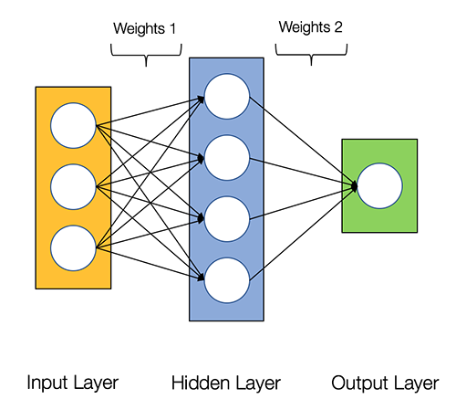
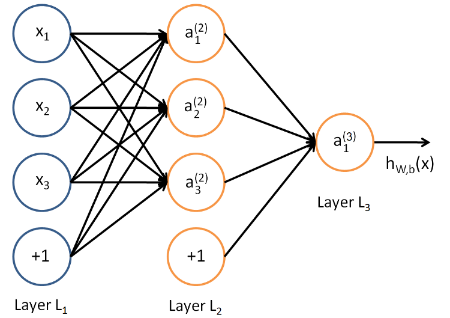
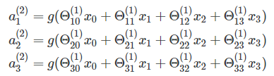
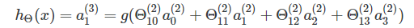
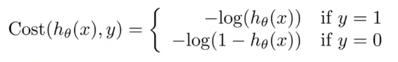

=============================
Multilayer Perceptron Project
=============================

********************
Theory and algorythm
********************

--------------------
Model Representation
--------------------

:Artificial Neural Network: is computing system inspired by biological neural network that constitute animal brain. Such systems “learn” to perform tasks by considering examples, generally without being programmed with any task-specific rules.

The Neural Network is constructed from 3 type of layers:

1. Input layer — initial data for the neural network.
2. Hidden layers — intermediate layer between input and output layer and place where all the computation is done.
3. Output layer — produce the result for given inputs.

In current project there are 4 layers:

- 1 input layer (size 30 as the number of features in data provided)
- 2 dense (hidden) layers (16 & 8 neurons by default)
- 1 output layer with 2 neurons (as we are classifying 2 classes)

weights initialization
----------------------

The way we initialize weights and biases may have a great impact on the model results and quality.
Here we initialize weights using Normalized Xavier initializer, and biases as small random numbers.

The shape of weight matrix on each layer depends on a sizes of this layer and the next layer
By default our weights shapes are:

1. (30, 16)
2. (16, 8)
3. (8, 2)

biases shapes are:

1. (16, 1)
2. (8, 1)
3. (2, 1)

-------------------
Forward propagation
-------------------

This process of Forward propagation is actually getting the Neural Network output value based on a given input.
This algorithm is used to calculate the cost value.

We take our input neurons, multiply them by weight matrix thus getting our linear transformation (usually referred as Zi)

Then we need to make a non-linear transformation (using activation function such as sigmoid or tanh). So we get our inputs for the next layer.

We repeat the procedure for all layers. On the last layer we use softmax function as an activation function so we can get the probabilities of each class which give 1 in total.

--------------------
Activation functions
--------------------

In Neural Network the activation function defines if given node should be “activated” or not based on the weighted sum.

In this project 4 types of activation functions are implemented:

1. RELU
2. Leaky RELU
3. Sigmoid
4. Tanh

RELU is used by default.

--------------------
Loss (cross-entropy)
--------------------

As we calculated some output y probabilities after forward propagation, we can calculate a loss.
Different loss functions can be used (Mean Square Error or Cross entropy loss). In this model we
calculate cross-entropy loss.

--------------------
Backward propagation
--------------------

Now we get some output probabilities values for our dependant variable. And we have calculated a loss. But as the weights were randomly chosen, the precision of our model is low. The loss is high.
We need to change our weights and biases for all layers, but how can we know the direction and the amount of that change?
We need to use some maths to do that. We need to calculate the derivatives of our loss function in order to get the changes for all the weights and biases.
And we need to apply derivative chain rule to backpropagate the error between layers.

----------------
Gradient Descent
----------------

We adjust our initial weights by subtracting derivatives (gradients) received during backpropagation phase multiplied by
a learning rate.

********
train.py
********

:run: python train.py data/data_training.csv -b=5 -r=0.03 -e=300 -m  -l -s
:run: python train.py data/data_training.csv -b=6 -r=0.03 -e=500. -m  -l -s

Multilayer perceptron input arguments::

- [-h]
- [--learning_rate R]
- [--loss]
- [--metrics]
- [--early_stopping]
- [--epochs E]
- [--batches B]
- [--dense1 D1]
- [--dense2 D2]
- [--model_filename F]
- [--activation_function A]
- filename

**********
predict.py
**********

Multilayer perceptron predict input arguments ::

- [-h]
- [--model_filename F]
- [--metrics]
- [--loss]
- filename

